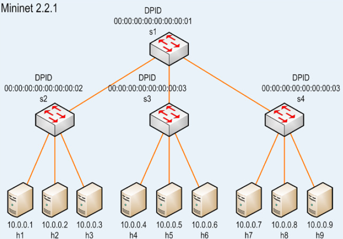

# Návrh

V našej práci sa budeme bližšie venovať aplikácii SOFTmon a overovaniu výsledkov dosiahnutých v zdrojovom článku. Budeme sa snažiť nasimulovať podmienky spojené s vyhodnotením práce. 

Ďalej budeme overovať sieť na vlastnej topológii. Výsledky v závere zhodnotíme a vyvodíme vlastný posudok na základe ktorého, overíme pravdivosť tvrdení v zdrojovom článku.

Analíza a overovanie výsledkov bude, bližšie sa venovať aplikácii SOFTmon. 

Overovanie výsledkov dosiahnutých v zdrojovom článku budeme realizovať pomocou:

* SOFTmon
* MININET 
* Linux Ubuntu 14.04
* Topológia 
    * Hĺbka 2 
    * Vetvenie 3

## Topológia siete

Obrázok č.1: Topológia siete.

Pre úplnosť je ale nutné dodať, že výsledky budú overované na inom stroji s iným operačným systémom ako je uvedený v zdrojovom článku. To by ale nemalo ovplyvňovať výsledky natoľko, aby nebolo možné overenie pravdivosti výsledných tvrdení článku.

## SOFTmon

SOFTmon je aplikácia nad sieťovou vrstvou SDN siete. Hlavnou myšlienkou SOFTmon je vizualizácia a monitorovanie siete. SOFTmon implementuje merania, ktoré monitorujú switch, porty a tokové štatistky, ktoré sú definované OpenFlow štandardom.

## MININET

MININET je sieťový emulátor. Spúšťa kolekciu koncových hostov, prepínačov, smerovačov na jednom jadre Linuxu.

Virtuálne hostiteľské počítače, prepínače, prepojenia a ovládače Mininet sú skutočné - sú vytvorené pomocou softvéru nie hardvéru - a väčšinou ich správania je podobné diskrétnym hardvérovým prvkom. Pomocou MININETu je možné vytvoriť sieť, ktorá sa podobá hardvérovej sieti alebo naopak, vytvoriť hardvérovú sieť ktorá sa podobá sieti vytvorenej pomocou MININETu a tým pádom je možné spúšťať rovnaký binárny kód a aplikácie na každej platforme.

## OpenFlow

OpenFlow je komunikačný protokol, ktorý umožňuje prístup k prepojovacej rovine sieťového prepínača alebo smerovača cez sieť.

OpenFlow umožňuje sieťovým kontrolórom určiť cestu sieťových paketov v sieti prepínačov. Ovládače sú odlišné od prepínačov. Toto oddelenie riadenia od presmerovania umožňuje sofistikovanejšiu správu premávky, ako je to možné pomocou zoznamov riadenia prístupu (ACL) a smerovacích protokolov. Tiež OpenFlow umožňuje prepínače od rôznych dodávateľov - často každý s vlastnými vlastnými rozhraniami a skriptovacími jazykmi - spravovať vzdialene pomocou jedného otvoreného protokolu. Autori tohto protokolu považujú OpenFlow za nástroj umožňujúci vytváranie sietí definovaných softvérom (SDN).

## Floodlight

Floodlight je Open SDN kontrolér.

* Ponúka modulárny systém ktorý je možné rozšírovať a zlepšovať
* Ľahký na používanie s minimálnymi závislosťami 
* Podporuje širokú škálu virtuálnych aj fyzických OpenFlow prepínačov. 
* Vie zvádnuť mix OpenFlow a non-OpenFlow sietí
