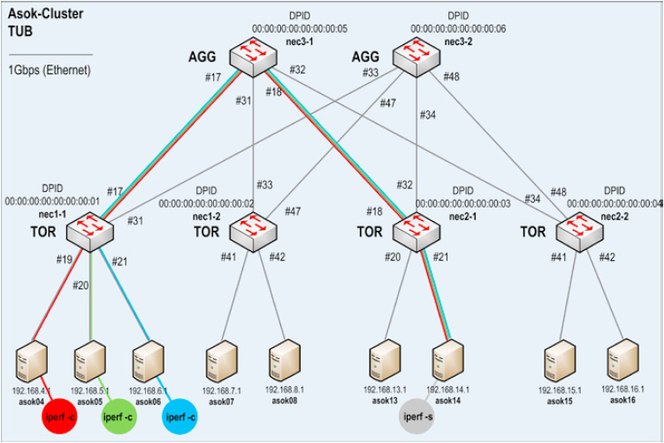

# Analýza

## SOFTmon

SOFTmon je aplikácia nad sieťovou vrstvou SDN siete. Hlavnou myšlienkou SOFTmon je vizualizácia a monitorovanie siete. SOFTmon implementuje merania, ktoré monitorujú switch, porty a tokové štatistky, ktoré sú definované OpenFlow štandardom.

Obrázok č.1: Grafické rozhranie programu SOFTmon.

## MININET

MININET je sieťový emulátor. Spúšťa kolekciu koncových hostov, prepínačov, smerovačov na jednom jadre Linuxu.

Virtuálne hostiteľské počítače, prepínače, prepojenia a ovládače Mininet sú skutočné - sú vytvorené pomocou softvéru nie hardvéru - a väčšinou ich správania je podobné diskrétnym hardvérovým prvkom. Pomocou MININETu je možné vytvoriť sieť, ktorá sa podobá hardvérovej sieti alebo naopak, vytvoriť hardvérovú sieť ktorá sa podobá sieti vytvorenej pomocou MININETu a tým pádom je možné spúšťať rovnaký binárny kód a aplikácie na každej platforme.

## OpenFlow

OpenFlow je komunikačný protokol, ktorý umožňuje prístup k prepojovacej rovine sieťového prepínača alebo smerovača cez sieť.

OpenFlow umožňuje sieťovým kontrolórom určiť cestu sieťových paketov v sieti prepínačov. Ovládače sú odlišné od prepínačov. Toto oddelenie riadenia od presmerovania umožňuje sofistikovanejšiu správu premávky, ako je to možné pomocou zoznamov riadenia prístupu (ACL) a smerovacích protokolov. Tiež OpenFlow umožňuje prepínače od rôznych dodávateľov - často každý s vlastnými vlastnými rozhraniami a skriptovacími jazykmi - spravovať vzdialene pomocou jedného otvoreného protokolu. Autori tohto protokolu považujú OpenFlow za nástroj umožňujúci vytváranie sietí definovaných softvérom (SDN).

## Floodlight

Floodlight je Open SDN kontrolér.

* Ponúka modulárny systém ktorý je možné rozšírovať a zlepšovať
* Ľahký na používanie s minimálnymi závislosťami 
* Podporuje širokú škálu virtuálnych aj fyzických OpenFlow prepínačov. 
* Vie zvádnuť mix OpenFlow a non-OpenFlow sietí

# Návrh

V našej práci sa budeme bližšie venovať aplikácii SOFTmon a overovaniu výsledkov dosiahnutých v zdrojovom článku. Aplikácia ako aj jej zdrojové súbory sú dostupné na adrese:
>https://github.com/mha-net/SOFTmon

## Evaluácia dosiahnutých výsledkov

Budeme sa snažiť nasimulovať podmienky spojené s finálnym vyhodnotením práce. Dosiahnuť sa to pokusíme dodržaním krokov pomocou ktorých vyhodnocovali SOFTmon program autori článku. Ako prvé vytvoríme topológiu siete ktorá je zobrazená na obrázku č.4. V nej budeme generovať trafiku siete pomocou ipref tool. Výsledky naších meraní následne porovnáme s výsledkami ku ktorým sa dopracovali autori článku. 

Tý tvrdia, že na obrázku č.2, je znázornená ipref configurácia serveru a clienta, ktorá bola použitá na vyhodnotenie meraní SOFTmon porgramu. Ipref clienti  boli nakonfigurovaný s obmedzenou rýchlosťou prenosu 100Mbit/s s cieľom vyhnúť sa zápche trafiky siete. 
V práci autori uviedli, že graf vľavo na obrázku č.3. ktorý je zachytený priamo z programu SOFTmon,a ten zobrazuje namerané hodnoty pripustnosti na porte 19, prepínača nec1-1. To je prichádzajúca (RX) trafika z clienta asok04, ktorá dosahuje priemerne 12,5MByte/s. To korešponduje s nastavenou priepustnosťou 100 Mbit/s. Tak isto Tvrdia že graf na pravo znázorňuje odchádzajúcu priepustnosť portu 18, prepínača nec3-1, ktorý je sumou všetkých troch prepínačov (asok04 až asok06). Trafika siete, ktorá bola nastavená na 100Mbit/s na clienta, dosahuje v priemere hodnotu 37,5MByte/s, čo znova korešponduje s nastavenou prenosovou rýchlosťou s hodnotou 300Mbit/s.

Tieto výsledky overíme a zhodnotíme pravdivosť tvrdení ktoré autori v článku uvádzajú.

Overovanie výsledkov dosiahnutých v zdrojovom článku budeme realizovať pomocou nasledujúcich nástrojov:

* SOFTmon
* MININET 2.2.1
* Linux Ubuntu 14.04
* OpenFlov v1.3
* Topológia siete s hĺbkou 2 a vetvením 3 ako je znázornené na obrázku č.4.
* ipref tool

Obrázok č.2: ipref configurácia.

Obrázok č.3: Graf  meraní z programu SOFTmon.

## Topológia siete

Obrázok č.4: Topológia siete.

Pre úplnosť je ale nutné dodať, že výsledky budú overované na inom stroji s iným operačným systémom ako je uvedený v zdrojovom článku. To by ale nemalo ovplyvňovať výsledky natoľko, aby nebolo možné overenie pravdivosti výsledných tvrdení článku.

Použité prostredie v práci:

Systém | Hardware | OS/Firmware
-------|----------|-----------
Cluster Node | 2 Intel Xeon Quad-Core 2,66 GHz, 32GB RAM | Ubuntu Server 14.04.3 LTS 64 bit
NOS Node | Pentium Dual-Core E5500 2,80GHz, 4GB RAM | Ubuntu Desktop 14.04.3 LTS 64 bit
Monitoring PC | Intel Core i7 2,8 GHz, 8GB RAM | Windows 7 Professional 64 bit
Switches NEC | IP8800/S3640-48T | OS-F3L Ver. 11.1.C.Af

## Doplnenie Programu

V našej práci s programom SOFTmon sa budeme tak isto venovať aj jeho vylepšeniu. Za úlohu sme si preto dali vytvoriť okno ktoré zobrazí topologiu v grafickej podobe pre ľahšiu prácu s nastrojom. Okno umožní používateľovi zobraziť si topológiu siete ku ktorej je práve pripojený. Na vykreslenie grafu využijeme knižnicu JUNG, ktorá je voľne dostupná a tak zachováme Open Source zameranie projektu.
